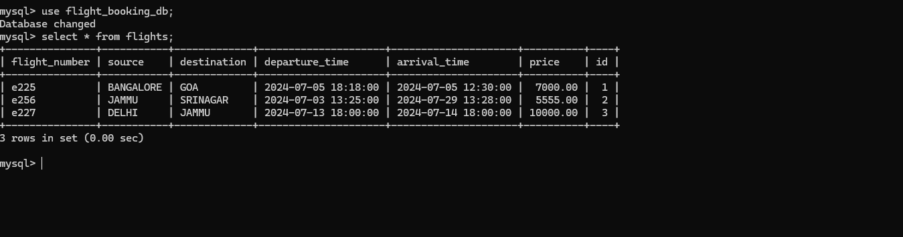

# Flight Booking Database

## Overview

This project is a web application for managing flight bookings using Flask and MySQL. The application allows users to perform CRUD (Create, Read, Update, Delete) operations on flight data through a user-friendly web interface.

## Features

- Insert new flight data
- Display all flight data
- Update existing flight data
- Delete flight data

## Technologies Used

- Flask (Python web framework)
- MySQL (Database)
- HTML, CSS (Frontend)

## Prerequisites

Before you begin, ensure you have met the following requirements:

- Python 3.x installed on your machine
- MySQL server installed and running
- Flask installed (`pip install Flask`)
- MySQL Connector installed (`pip install mysql-connector-python`)

## Installation and Setup

1. **Clone the repository:**

   ```bash
   git clone https://github.com/yourusername/flight-booking-database.git
   cd flight-booking-database
2. **Set up the MySQL database:**
   * Create a new database named `flight_booking_db`.
   * Create a `flights` table with the following schema:

   ```sql
   CREATE TABLE flights (
     id INT AUTO_INCREMENT PRIMARY KEY,
     flight_number VARCHAR(255) UNIQUE NOT NULL,
     source VARCHAR(255) NOT NULL,
     destination VARCHAR(255) NOT NULL,
     departure_time DATETIME NOT NULL,
     arrival_time DATETIME NOT NULL,
     price DECIMAL(10, 2) NOT NULL
   );
3. **Configure the database connection:**
   * Update the database connection details in the `app.py` file:

   ```python
   def get_db_connection():
       connection = mysql.connector.connect(
           host='localhost',
           user='your_mysql_username',
           password='your_mysql_password',
           database='flight_booking_db'
       )
       return connection
4. **Run the application:**

   ```bash
   python app.py

The application will be available at http://127.0.0.1:5000.
## Usage

1. **Home Page:**
   * Displays a list of all flights in the database.
   * Provides links to edit or delete each flight.

2. **Add Flight:**
   * Click on the "Add Flight" button on the home page to open the add flight form.
   * Fill in the flight details and click "Add Flight" to insert a new flight into the database.

3. **Update Flight:**
   * Click on the "Edit" link next to a flight on the home page to open the update flight form.
   * Modify the flight details and click "Update Flight" to save the changes.

4. **Delete Flight:**
   * Click on the "Delete" link next to a flight on the home page to remove the flight from the database.
## Screenshots



## License

This project is licensed under the MIT License. See the [LICENSE](LICENSE) file for details.
## Acknowledgements

* [Flask Documentation](https://flask.palletsprojects.com/)
* [MySQL Documentation](https://dev.mysql.com/doc/)
